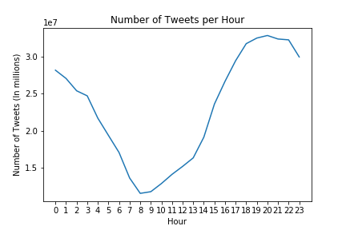
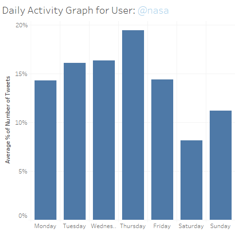
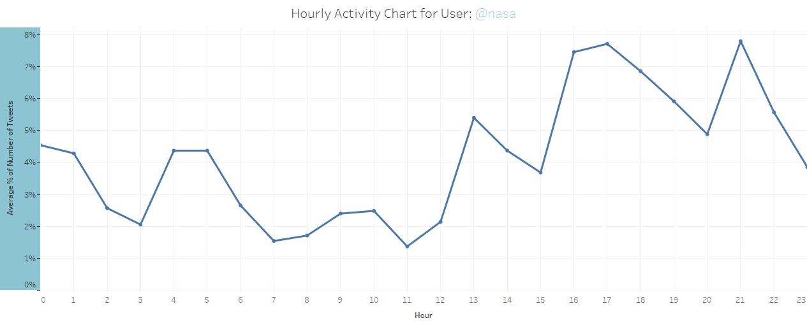

# tweet-analysis
Simple tools written in Python for extracting big data related to tweets. Includes tokenizer, data visualization, and other tools for preparing data analysis and NLP algorithms. 

It also includes a tool for exporting the collected data as csv file for the purpose of making data manipulation simpler. I have included example charts and graphs in this respository as well as some using Tableau which can be found here: https://public.tableau.com/profile/uriel.ulloa#!/vizhome/twitter-test/Sheet2

You can find the required data using this link: http://lst.science.ru.nl/~proycon/twitterdata.zip

## Introduction
Understanding social media and how users interact with social media is a valuable tool for marketers. Knowing when your targeted or general audience is most likely to view your business's tweet before you even post your tweet can prove to be a tool for maximizing the outreach of your company. In Python, I will use data extraction techniques, object-oriented programming, and data manipulation techniques to create a graph and dataset to visualize Twitter users' activity.

## Creating the Corpus
Before starting, I must obtain a dataset which contains information about Twitter users and/or their tweets. Ideally, you would want to do this through Twitter's API which would remove the need for this step but for demonstration purposes I will use a large collection of text files of tweets which you download through this link: http://lst.science.ru.nl/~proycon/twitterdata.zip

Since the files are all separate, I must first join them together to form a single large text file which I can use as a corpus. I define a function called make_twittercorpus(directory) that puts together all the text files that I have in my data directory. I also create a helper function called list_textfiles(directory) which lists all the files in the directory which returns the filenames of all the files in the directory.

After putting all the text files together, it is time to figure out how we are going to extract the data from it. After a quick glance at the text file, we can see that the features are already separated by tabs so we can easily get the username, timestamp, and tweet message by using these tabs as separators.

## Object-oriented Abstraction
If you wish you can immediately create a .cvs file to make a chart. However, I will add a bit of abstraction to my project to make the program a bit easier to understand and manipulate in the future. The advantage to this is that I can create functions that perform tasks and manipulations we might want to perform repetitively. This is a lot easier to understand than writing lines of code such as data[data['username' == 'user']]['tweet'] every time I want to get a tweet from a specific user. Instead, I can just write a class called TwitterUser that has a function called user.getTweets() instead. Although its functionality may be more or less the same, the getTweets() function is much easier to read and understand which is important if other people are going to read and work on your code.

I create three classes: TwitterGraph, Tweet, and TwitterUser each with their unique attributes and functions. Every twitter user has three attributes: username, a list of their tweets which are Tweet objects in our case, and a dictionary of people they have mentioned in their tweets. The last attribute isn't exactly necessary but I think it might be interesting to see who people mention in their tweets. The Tweet object really only needs two attributes: message and timestamp. To avoid some headaches later, I also added additional attributes and functions for getting the hour and day of the week from the timestamp. The TwitterGraph is the final layer of abstraction as it is the object that will hold all these TwitterUsers who each hold their own list of tweets. It is essentially a dictionary that holds every user with some added functionality. If we ever wanted to write a function that would include every or a large set of TwitterUsers, then we would want to encapsulate it here as it is the object that connects them together. 

## Creating the Dataset
Now that I have my classes, I can begin to create objects and store them in the TwitterGraph. This function I write inside my TwitterGraph function as its initialization function. Every line in my text file is a tweet that follows this pattern "@username tab timestamp tab message newline" so I can easily extract features as I read them. Every time I come across a user that is not in my TwitterGraph, I create a new TwitterUser and initialize it with the data extracted from the current tweet I am looking at. Sometimes, you may find some of the data is missing so, in this case, I labeled missing data as either NaN or NaT which Pandas understands as a missing value. After reading the text file, my TwitterGraph object holds all the TwitterUsers which holds all of their respective tweets.

I decided create my .csv-making code separate from the TwitterGraph initialization to keep my code clean. I also decided to make two seperate .csv files, one for displaying twitter users and their tweets and another for displaying twitter users and the people they mention. The reasoning for this is because a single tweet can contain multiple mentions and I want to avoid adding cells with multiple values or creating extra rows which can be detrimental to my analysis. Note, you will want to separate values with tabs instead of commas since some tweet messages might contain commas. The end result is datasets that looks like this:
```
 username   user_mentioned  num_times_mentioned
0  scaryjam  missinglink1125                    1
1  scaryjam      youtubeさんから                    3
2  scaryjam       f1gateさんから                    2
3  scaryjam       nurupo6430                    1
4  scaryjam         tvgroove                    1

Tweet messages csv:

username         date  year  day      time  hour  \
0  scaryjam  2011-03-14   2011  0.0  06:29:47   6.0   
1  scaryjam  2012-03-02   2012  4.0  09:33:01   9.0   
2  scaryjam  2012-11-20   2012  1.0  07:31:00   7.0   
3  scaryjam  2012-07-23   2012  0.0  08:30:25   8.0   
4  scaryjam  2011-04-22   2011  4.0  11:48:39  11.0   

                                             message  
0  RT @missinglink1125: 地震発生翌日の写真 http://twitpic....  
1  http://t.co/XFuxTMbT Exclusive: Triple H count...  
2  http://t.co/HliazujX, Burgers, FIve Guys Burge...  
3  ニュルブルクリンク、破産の危機 【 http://t.co/115hvF7S 】 http:...  
4  RT @NURUPO6430: Sominカー試作1号機「すかりーちゃん号」上http://...  
```
## Cleaning the Data
Depending on what you want to do with the data, you will probably want to find a way to deal with the missing values that we came across earlier. In most cases, you can either decide to remove them or put in a placeholder. In this case, you will want to remove them depending on them column you need since there are no good placeholders for these types of data entries.

## Acivity Graphs


The data we have is complete and ready for visualization and use in statistics. You can use which ever language or software you are comfortable with and play with the data. Here are some statistic charts I created for visualizing the peak activity for all twitter users. The overall total average number of tweets posted per hour. You can see that tweet activity is its lowest during 6-13:00 which strongly suggests you should avoid that time if you want your tweet to be seen immediately. Additionally, you can see that activity is highest during the later hours which might be the most desirable time range to post a tweet since its when most people are actively using the application.

## Results and Future Work
With the data I was able to extract from this dataset, I was able to create graphs that illustrate user activity that can be clearly understood just by looking at it. This can be used to more calculated decisions and help guide a marketing team's social media strategy. Understanding trends is valuable when you want to maximum the amount of people you can reach and in the modern age, social media is almost necessary if your intended audience uses social media (which is most people.)

Perhaps more importantly, this project was designed and programmed in a way that makes it easy to adapt and further build upon if necessary. Many of the functions written are generalized and the object-oriented structure makes it easy to add extra functionality to modify individual or multiple objects. Incorporating good programming practices when working on any project is always a necessary, especially when you are collaborating and working as a team.  Adding layers of abstraction to your programs helps keep your code organized and easy to read.

Since the programs and data are very generalized, it is not unfeasible to implement advance features such as a Naive Bayes Classifier that can recognized future tweets posted by Nasa as many of the necessary features are stored in the data set and I have already created a tokenizer for preparing bag-of-word models.

This is a straightforward explanation of how I approached this problem. There are several extra tools, lines of code, and functionality that I have added to this program that are not mentioned in this post.

### Possible Future Goals and Things to Learn
- Improve data visuals and statistics produced.
- Add Front-End/Back-End components to make the program user-friendly.

## Additional graphs


